# 类图

> 参考：[《Java设计模式》](https://book.douban.com/subject/30173863/)

类图：用于描述系统中所包含的类以及它们之间的相互关系。

## 类之间的关系

1. **关联关系**

   关联（Association）关系用于**表示一类对象与另一类对象之间有关系**。在 UML 类图中用实现连接有关联的对象所对应的类，在使用 Java、C# 和 C++ 等编程语言实现关联关系时，**通常将一个类的对象作为另一个类的成员变量**。在使用类图时，可以在关联线上标注角色名（一般用表示两者关系的动词或名词表示），关系的两端代表两种不同的角色，因此在一个关联关系中可以包含两个角色名。角色名非必需，可按需添加，其目的是使类之间的关系更明确。

   示例：

   

   关联关系通常包含以下几种形式：

   1. 单向关联

      

   2. 双向关联

      

   3. 自关联

      

   4. 多重性关联

      多重性关联关系又称重数性（Multiplicity）关联关系，表示两个关联对象在数量上的对应关系。

      | 表示方式 | 多重性说明                                                   |
      | -------- | ------------------------------------------------------------ |
      | 1..1     | 表示另一个类的一个对象只与该类的一个对象有关系               |
      | 0..*     | 表示另一个类的一个对象与该类的零个或多个对象有关系           |
      | 1..*     | 表示另一个类的一个对象与该类的一个或多个对象有关系           |
      | 0..1     | 表示另一个类的一个对象与没有或只与该类的一个对象有关系       |
      | m..n     | 表示另一个类的一个对象与该类的最少 m、最多 n 个对象有关系（m ≤ n） |

      

   5. **聚合关系**

      聚合（Aggregation）关系表示整体与部分的关系。在聚合关系中，成员对象是整体对象的一部分，但是成员对象**可以脱离整体对象独立存在**。

      **成员对象通常作为构造方法、Setter 方法或业务方法的参数注入到整体对象中。**

      

   6. 组合关系

      组合（Composition）关系也表示类之间整体和部分的关系，但是在组合关系中整体对象可以空坠成员对象的生命周期，一旦整体对象不存在，成员对象也将不存在，成员对象和整体对象之间具有**同生共死**的关系。

      **成员对象通常在整体类的构造方法中直接实例化成员对象。**

      

2. **依赖关系**

   依赖（Dependency）关系是一种**使用**关系，特定事物的改变有可能会影响到使用该事物的其他事物，在需要表示一个事物使用另一个事物时使用依赖关系。

   大多数情况下，依赖关系体现在某个类的方法使用另一个类的对象作为参数。

   

   依赖关系的通常通过 3 种方式来实现：

   1. 将一个类的对象作为另一个类种的方法的参数；
   2. 在一个类的方法中将另一个类的对象作为局部变量；
   3. 在一个类的方法中调用另一个类的静态方法。

3. **泛化关系**

   泛化（Generalization）关系也就是继承关系，用于描述父类与子类之间的关系，父类又称作基类或超类，子类又称作派生类。

   使用面向对象的继承机制来实现泛化关系。

   

4. **实现关系**

   实现关系是接口与类之间的关系，在这种关系中类实现了接口，类中的操作实现了接口中所声明的操作。

   
