# 代理模式

## 概述

由于某些原因，客户端不想或不能直接访问一个对象，此时可以通过一个成为“代理”的第三者来实现间接访问，该方案对应的设计模式被称为代理模式。

代理模式是一种应用很广的结构型设计模式，而且变化形式非常多，常见的代理形式有远程代理、保护代理、虚拟代理、缓冲代理、智能引用代理等。

**代理模式**：给某一个对象提供一个代理或占位符，并由代理对象来控制对原对象的访问。

> **Proxy Pattern**: Provide a surrogate or placeholder for another object to control access too it.

代理模式是一种对象结构性模式。

## 结构与实现

### 结构

代理模式结构如下图所示。

代理模式包含 3 个角色：

1. **Subject（抽象主题角色）**：声明了真实主题和代理主题的共同接口，这样一来在任何使用真实主题的地方都可以使用代理主题，客户端通常需要针对抽象主题角色进行编程。
2. **Proxy（代理主题角色）**：包含了对真实主题的引用，从而可以在任何时候操作真实主题对象，在代理主题角色中提供了一个与真实主题角色相同的接口，以便在任何时候都可以代替真实主题对象；代理主题角色还可以控制对真实主题的使用，负责在需要的时候创建和删除真实主题对象，并对真实主题对象的使用加以约束。通常，在代理主题角色中客户端在调用所引用的真实主题操作之前或之后还需要执行其他操作，而不仅仅是单纯调用真实主题对象中的操作。
3. **RealSubject（真实主题角色）**：定义了代理角色所代表的真实对象，在真实主题角色中实现了真实的业务操作，客户端可以通过代理主题角色间接调用真实主题角色中定义的操作。

### 实现

[代理模式实现示例](./examples/designpattern/proxy)

几种常用的代理模式：

1. 远程代理（Remote Proxy）：为一个位于不同的地址空间的对象提供一个本地的代理对象，这个不同的地址空间可以在同一台主机中，也可以在另一台主机中，远程代理又称为大使（Ambassador）。
2. 虚拟代理（V/irtual Proxy）：如果需要创建一个资源消耗较大的对象，先创建一个消耗较小的对象来表示，真实对象只需要在需要时才会被真正创建。
3. 保护代理（Protect Proxy）：控制对一个对象的访问，可以给不同的用户提供不同级别的使用权限。
4. 缓冲代理（Cache Proxy）：为某一个目标操作的结果提供临时的存储空间，以便多个客户端可以共享这些结果。
5. 智能引用代理（Smart Reference Proxy）：当一个对象被引用时提供一些额外的操作，例如将对象的调用次数记录下来等。

## Java 动态代理

动态代理（Dynamic Proxy）可以让系统在运行时根据实际需要来动态创建创建代理类，让同一个代理类能够代理多个不同的真实主题类而且可以代理不同的方法。动态代理是一种较为高级的代理模式，它在事务管理、AOP（Aspect-Oriented Programming）等领域都发挥了重要的作用。

Java 的动态代理需要用到 java.lang.reflect.Proxy，java.lang.reflect.InvocationHandler。JDK 提供的动态代理只能代理一个或多个接口，如果需要动态代理具体类或抽象类，可以使用 CGLib（Code Generation LIbrary）等工具。

[JDK 动态代理示例](./examples/designpattern/proxy)

## 优/缺点与适用环境

### 优点

代理模式的共同优点：

1. 能够协调调用者和被调用者，在一定程度上降低了系统的耦合性。
2. 客户端可以针对抽象主题角色进行编程，增加和更换代理类无需修改源代码，符合开闭原则，系统具有较好的灵活性和可扩展性。

不同的代理模式具有独特的优点，例如：

1. 远程代理为位于两个不同地址空间的对象的访问提供了一种实现机制，可以将一些消耗资源较多的对象和操作移至性能更好的计算机上，提高了系统的整体运行效率。
2. 虚拟代理通过一个消耗资源较少的对象来代表一个消耗资源较多的对象，可以在一定程度上节省系统的运行开销。
3. 缓冲代理为某一个操作的结果提供临时的缓存存储空间，以便在后续后续使用中能够共享这些结果，优化系统性能，缩短执行时间。
4. 保护代理可以控制对一个对象的访问权限，为不同用户提供不同级别的使用权限。

### 缺点

1. 由于在客户端和真实主题之间增加了代理对象，因此有些类型的代理模式可能会造成请求的处理速度变慢，例如保护代理。
2. 实现代理模式需要额外的工作，而且有些代理模式的实现过程较为复杂，例如远程代理。

### 适用环境

不同的代理模式有不同的优/缺点，它们应用于不同的场合：

1. 当客户端对象需要访问远程主机中的对象时可以使用远程代理。
2. 当需要用一个消耗资源较少的对象来代表一个消耗资源较多的对象，从而降低系统开销，缩短运行时间时可以使用虚拟代理，例如一个对象需要很长时间才能完成加载时。
3. 当需要为某一个被频繁访问的操作结果提供一个临时存储空间，一共多个客户端共享访问这些结果时，可以使用缓冲代理。通过使用缓冲代理，系统无需在客户端每一次访问时都重新执行操作，只需直接从临时缓存区获取操作结果即可。
4. 当需要控制对一个对象的访问为不同的用户提供不同级别的访问权限时可以使用保护代理。
5. 当需要为一个对象的访问（引用）提供一些额外的操作时可以使用智能引用代理。
