# 策略模式

## 概述

在软件开发中通常会有，实现某一个功能（例如排序、查找等）有多种算法，一种常用的方法是通过硬编码（Hard Coding）将所有的算法几种在一个类中，在该类种提供多个方法，每一个方法对应一个具体的算法；当然也可以将这些算法封装在一个统一的方法中，通过 if...else... 等条件判断语句进行选择。这两种实现方式都可以称为硬编码，如果需要增加一种新的算法，需要修改算法类的源码；更换算法也需要修改客户端调用代码。在这个统一的算法类中封装了大量算法，代码非常复杂，维护也很困难。

此时可以使用策略模式来实现灵活选择算法，还能够方便地增加新的算法。

**策略模式**：**定义一系列算法**，将每一个算法封装起来，并**让他们可以相互替代**。策略模式让算法可以独立于使用它的客户而变化。

> **Strategy Pattern**: Define a family of algorithms, encapsulate each one, and make them interchangeable. Strategy lets the algorithms vary iindependently from clients that use it.

策略模式又称为政策（Policy）模式，它是一种对象行为型模式。

## 结构与实现

### 结构

策略模式结构图如下所示。

策略模式包含 3 个角色：

1. **Context（环境类）**：环境类是使用算法的角色，他在解决某个问题（即实现某个功能）时可以采用多种策略。在环境类中维持一个对抽象策略类的引用实例，用于定义所采用的策略。
2. **Strategy（抽象策略类）**：抽象策略类位所支持的算法声明了抽象方法，时所有策略类的父类。它**可以是抽象类或具体类，也可以是接口**。环境类通过抽象策略类中声明的方法运行时调用具体策略类中实现的算法。
3. **ConcreteStrategy（具体策略类）**：具体策略类实现了在抽象策略类中声明的算法，在运行时具体策略类将覆盖在环境类中定义的抽象策略对象，使用一种具体的算法实现某个业务功能。

### 实现

[策略模式实现示例](./examples/designpattern/strategy)

## 优/缺点与适用环境

### 优点

1. 策略模式提供了对开闭原则的完美支持，用户可以在不修改原有系统的基础上选择算法或行为，也可以灵活地增加新的算法或行为。
2. 策略模式提供了管理相关的算法族的办法，策略类的等级结构定义了一个算法或行为族，恰当地使用继承可以把公共的代码转移到抽象策略类中，从而避免重复的代码。
3. 策略模式提供了一种可以替换继承关系的办法。如果不使用策略模式，那么使用算法的环境类就可能会有一些子类，每一个子类提供一种不同的算法。但是这样依赖算法的使用和算法本身混在一起，不符合单一职责原则，而且使用继承无法实现算法或行为在程序运行时的动态切换。
4. 使用策略模式可以避免多重条件选择语句。多重条件选择语句不易维护，它把采取哪一种算法或行为的逻辑与算法或行为本身的实现逻辑混合在一起，将它们全部硬编码在一个庞大的多重条件选择语句中，比直接继承环境类的办法还要原始和落后。
5. 策略模式提供了一种算法的复用机制，由于将算法单独提取出来封装在策略类中，因此不同的环境类可以方便地复用这些策略。

### 缺点

1. 客户端必须知道所有的策略类，并自行选择使用哪一个策略类。这就意味着客户端必须理解这些算法的区别，以便适时选择恰当的算法。换而言之，策略模式只适用于客户端知道所有算法或行为的情况。
2. 策略模式将造成系统产生很多具体策略类，任何细小的变化都讲导致系统要增加一个新的具体策略类。
3. 无法同时在客户端使用多个策略模式，也就是说，在使用策略模式时客户端每次只能使用一个策略类，不支持使用一个策略类完成部分功能后再使用另一个策略类完成剩余功能的情况。

### 适用环境

1. 一个系统需要动态地在几种算法中选择一种，那么可以将这些算法封装到一个个点具体算法类中，而这些具体算法类都是一个抽象算法类的子类。换而言之，这些具体算法类均有统一的接口，很具里氏代还原则和面向对象的多态性，客户端可以选择使用任何一个具体的算法类，并只需要维持一个数据类型是抽象算法类的对象。
2. 一个对象有很多行为，如果不用恰当的模式，这些行为则治好使用多重条件选择语句来实现。此时使用策略模式把这些行为转移到相应的具体策略类里面，就可以避免使用难以维护的多重条件选择语句。
3. 不希望客户端之后复杂的、与算法相关的数据结构，在具体策略类中封装算法与相关的数据结构，可以提高算法的保密性和安全性。

