# 简单工厂模式

## 概述

**简单工厂模式**（**Simple Factory Pattern**）：定义一个工厂类，它可以**根据参数的不同返回不同的类实例**，被创建的实例通常都具有共同的父类。

由于在简单工厂模式中用于创建实例的方法通常是静态（static）方法，因此简单工厂模式又被称为静态工厂方法（Static Factory Method）模式，它是一种**类创建型模式**。

例如：有一个水果农场，能够根据用户提供的水果名称返回指定的水果。在此，水果农场被称为工厂（Factory），生成的水果被称为产品（Product），水果的名称则被称为参数。用户无需知道水果是如何生产的，只需要提供水果的名称即可得到相应的水果。

## 结构和实现

### 结构

结构如下图所示。


简单工厂模式包含三个角色：

1. **Factory（工厂角色）**：工厂角色即工厂类，是简单工厂模式的核心，负责实现创建所有产品实例的内部逻辑。工厂类提供静态方法供外部调用获取指定产品，返回类型为抽象产品类型（Product）。
2. **Product（抽象产品角色）**：工厂类所创建的所有对象的父类，封装了各种产品对象的公有方法。所创建的对象都是它的子类，在工厂类中只需要定义一个通用的工厂方法，能够提高系统的灵活性。
3. **ConcreteProduct（具体产品角色）**：简单工厂模式的创建目标，所有被创建对象都是这个角色的某个具体类的实例。

### 实现

```java
abstract class Product {
    public abstract void method();
}

class ConcreteProductA extends Product {

    @Override
    public void method() {
        System.out.println("This is method of ConcreteProductA.");
    }
}

class ConcreteProductB extends Product {

    @Override
    public void method() {
        System.out.println("This is method of ConcreteProductB.");
    }
}

class Factory {
    public static Product createProduct(String name) {
        switch (name) {
            case "A":
                return new ConcreteProductA();
            case "B":
                return new ConcreteProductB();
            default:
                // throw new RuntimeException("invalid product name");
                return null;
        }
    }
}

public class Client {
    public static void main(String[] args) {
        Product productA = Factory.createProduct("A");
        Product productB = Factory.createProduct("B");
        productA.method();
        productB.method();
    }
}
```

## 关于创建对象和使用对象

一个对象相关的职责通常有 3 类：对象本身所具有的职责、创建对象的职责和使用对象的职责。

在 Java 语言中通常有以下几种创建对象的方式：

1. 使用 new 关键字直接创建对象。
2. 通过反射机制创建对象。
3. 通过克隆方法创建对象。
4. 通过工厂类创建对象。

直接使用 new 最简单，但是灵活性较差。

所有的工厂模式都强调一点：两个类之间的关系应该仅仅是创建或是使用，而不能两者都有。将创建和使用分离，能够使系统更符合单一职责原则，有利于对功能的复用和系统的维护。

将对象和创建分离，可以防止用来实例化类的数据和代码到处都是。同时，使用工厂来还可以针对类不同的构造方法重新提供一个更符合语义的创建方法，如下所示。

```java
class Rectangle {
    private final int width;
    private final int height;

    Rectangle(int width) {
        this.height = this.width = width;
    }

    Rectangle(int width, int height) {
        this.width = width;
        this.height = height;
    }
}

class RectangleFactory {
    // 创建正方形
    public static Rectangle createSquare(int width) {
        return new Rectangle(width);
    }

    // 创建矩形
    public static Rectangle createRectangle(int width, int height) {
        return new Rectangle(width, height);
    }
}
```

## 简化

可以将工厂类和抽象类合并，将简单工厂模式进行简化。



## 优/缺点和适用环境

### 优点

1. 实现对象**创建和使用分离**。工厂类只负责创建，客户端只负责使用。
2. 客户端无需知道所创建的具体产品类的类名，只需要知道具体产品类所对应的参数即可，对于复杂类名，能够减少使用者的记忆量。
3. 通过引入配置文件，可以在不修改任何客户端代码的情况下更换和增加新的具体产品类，在一定程度上提高了系统的灵活性。

### 缺点

1. 工厂类集中类**所有产品的创建逻辑，职责过重**，一旦不能正常工作，整个系统都要受影响。、
2. 会增加系统中类的个数，增加系统的复杂度和理解难度。
3. 系统扩展困难，一旦添加新产品就不得不修改工厂逻辑，在产品类型较多时有可能造成工厂逻辑过于复杂，不利于系统的扩展和维护。
4. 由于使用了静态方法，造成工厂角色无法形成基于继承的等级结构。

### 适用环境

1. 工厂类负责创建的对象比较少，由于创建的对象较少，不会造成工厂方法中的业务逻辑过于复杂。
2. 客户端只知道传入工厂类的参数，对于如何创建对象并不关系。
