# 简单工厂模式

## 概述

**简单工厂模式**（**Simple Factory Pattern**）：定义一个工厂类，它可以**根据参数的不同返回不同的类实例**，被创建的实例通常都具有共同的父类。

由于在简单工厂模式中用于创建实例的方法通常是静态（static）方法，因此简单工厂模式又被称为静态工厂方法（Static Factory Method）模式，它是一种创建型模式。

例如：有一个水果农场，能够根据用户提供的水果名称返回指定的水果。在此，水果农场被称为工厂（Factory），生成的水果被称为产品（Product），水果的名称则被称为参数。用户无需知道水果是如何生产的，只需要提供水果的名称即可得到相应的水果。

## 结构和实现

