# 工厂方法模式

## 概述

使用简单工厂模式时，如果需要新增一种具体产品类就不得不修改工厂类的代码，这在一定程度上违反了开闭原则。解决这个问题，可以引入一个抽象工厂类，不再提供统一的工厂类来创建所有的产品，产品的创建交由专门的工厂子类来完成，如果需要新增一种具体的产品类，只需要定义一个具体的工厂类就可以创建该产品，而不再需要修改已有的工厂类代码，这就是工厂方法模式。通过引入抽象工厂类，使其具有超越简单工厂模式的优越性，让系统更符合开闭原则。

**工厂方法模式**：定义一个用于创建对象的接口，但是让子类决定将哪一个类实例化。工厂方法模式让一个类的实例化延迟到其子类。

> **Factory Method Pattern**: Define an interface for creating an object, but let subclasses decide which class to instantiate. Factory Method lets a class defer instantiation to subclasses. 

**工厂方法模式简称为工厂模式（Factory Pattern）**，又可称作虚拟构造器模式（Virtual Constructor Pattern）或多态工厂模式（Polymorphic Factory Pattern），是一种**类创建型模式**。

## 结构与实现

### 结构

工厂方法模式的结构图如下所示。



工厂方法模式包含 4 个角色：

1. **Product**（**抽象产品**）：定义产品的接口，是工厂方法模式所创建对象的超类型，也就是产品对象的公共父类。
2. **ConcreteProduct**（**具体产品**）：实现了抽象产品接口，某种类型的具体产品右专门的具体工厂创建，具体工厂和具体产品之间一一对应。
3. **Factory**（**抽象工厂**）：在抽象工厂类中生命力工厂方法（Factory Method），用于返回一个产品。抽象工厂是工厂方法模式的核心，所有创建对象的工厂类都必须实现该接口。
4. **ConcreteFactory**（**具体工厂**）：抽象工厂类的子类，实现了在抽象工厂类中声明的工厂方法，并可由客户端调用，返回一个具体产品类的实例。

### 实现

```java
abstract class Product {
    public abstract void method();
}

class ConcreteProduct extends Product {

    @Override
    public void method() {
        System.out.println("This is method of ConcreteProduct.");
    }
}

interface Factory {
    Product factoryMethod();
}

class ConcreteFactory implements Factory {

    @Override
    public Product factoryMethod() {
        System.out.println("Create a ConcreteProduct.");
        return new ConcreteProduct();
    }
}

public class Client {
    public static void main(String[] args) {
        Factory concreteFactory = new ConcreteFactory(); // 可通过配置文件与反射机制实现
        Product product = concreteFactory.factoryMethod();
        product.method();
    }
}
```

可以通过配置文件来存储具体工厂类的类名，再通过反射机制创建具体工厂对象，在更换新的具体工厂时无需修改源代码，系统扩展更为方便。

## 反射机制与配置文件

使用工厂方法模式时，如果需要更换具体产品时需要修改客户端代码，对于客户端而言不符合开闭原则。可以通过 Java 反射机制结合配置文件（例如 XML 文件）来生成具体工厂对象，而不直接使用 new 关键字。

**Java 反射机制**

Java 反射（Java Reflection）是指在程序运行时获取已知名称的类或已有对象的相关信息的一种机制，包括类的方法、属性、父类等信息，还包括实例的创建和实例类型的判断等。

可以通过 Class 类的 `forName(String className)`方法返回与带有给定字符串名的类或接口相关联的 Class 对象，再通过 Class 对象的 `newInstance()`方法创建此对象所表示的类的一个实例。例如：

```java
Class<?> c = Class.forName("java.lang.String");
Object o = c.newInstance();
```

**配置文件**

以 XML 文件作为配置文件为例，将类名存储到配置文件中，再读取配置文件获取类名字符串，通过反射创建对象。`config.xml` 示例如下：

```xml
<?xml version="1.0" encoding="utf-8" ?>
<config>
    <className>ConcreteFactory</className>
</config>
```

通过以下代码读取配置文件获取到类名来生成对象，代码示例如下：

```java
import org.w3c.dom.Document;
import org.w3c.dom.Node;
import org.w3c.dom.NodeList;

import javax.xml.parsers.DocumentBuilder;
import javax.xml.parsers.DocumentBuilderFactory;

public class XMLUtil {
    public static Object getBean() {
        try {
            DocumentBuilderFactory documentBuilderFactory = DocumentBuilderFactory.newInstance();
            DocumentBuilder builder = documentBuilderFactory.newDocumentBuilder();
            Document document = builder.parse("src/config.xml");

            NodeList nodeList = document.getElementsByTagName("className");
            Node classNameNode = nodeList.item(0).getFirstChild();
            String className = classNameNode.getNodeValue();

            Class<?> c = Class.forName(className);
            return c.newInstance();
        } catch (Exception e) {
            e.printStackTrace();
            return null;
        }

    }
}
```

Client 类的代码改为：

```java
public class Client {
    public static void main(String[] args)  {
        Factory factory = (Factory) XMLUtil.getBean();
        Product product = factory.factoryMethod();
        product.method();
    }
}
```

这样不管是新增一种新类型的产品，还是更换需要使用的产品都不需要修改原有代码，完全符合开闭原则。

## 工厂方法的重载

在某些情况下，可以通过多种方式来初始化同一个产品类。此时可以提供一组重载的工厂方法，以不同的方式对产品对象进行创建，这些方法可以包含不同的业务逻辑，以满足产品对象的多样化创建需求。

## 工厂方法的隐藏

有时候，为了进一步简化客户端的使用，把业务方法的调用移至工厂类中，可以直接使用工厂对象来调用产品对象的业务方法，客户端无需调用工厂方法创建产品对象。在某些情况下可以使用这种设计方案。

示例如下：

```java
// 抽象工厂类代码修改如下
abstract class Factory {
    public void method() {
        Product product = this.factoryMethod();
        product.method();
    }

    public abstract Product factoryMethod();
}

// 客户端代码修改如下
public class Client {
    public static void main(String[] args) {
        Factory factory = (Factory) XMLUtil.getBean();
        factory.method();
    }
}
```

## 优/缺点与适用环境

### 优点

1. 工厂方法用来创建客户所需要的产品，同时向客户隐藏了产品实例化的细节，用户只需要关注所需产品对应的的工厂，无需关心创建细节。
2. 基于工厂角色和产品角色的多态性设计是工厂方法模式的关键，这也是为什么又被称为多态工厂模式的原因。它能够让工厂自主确定创建何种产品对象，而创建的细节完全封装在具体工厂内部。
3. 在系统中加入新产品时无需修改原有代码，只要添加一个具体工厂和具体产品即可，系统的可扩展性变得非常好，完全符合开闭原则。

### 缺点

1. 添加新产品时需要添加具体的产品类，和与之对应的具体工厂类，系统中类的数量会成对增加，一定程度上增加了系统的复杂度，有更多的类需要编译和运行，会给系统带来一些额外的开销。
2. 考虑到系统的可扩展性，需要引入抽象层，在客户端代码中均使用抽象层进行定义，增加了系统的抽象性和理解难度。

### 适用环境

1. 客户端不知道他所需要的对象的类。在工厂方法模式中，客户端不需要知道具体产品类的类名，只需要知道所对应的工厂即可，具体产品对象由具体的工厂类创建，可将具体工厂类的类名存储在配置文件或数据库中。
2. 抽象工厂类通过其子类来追定创建哪个对象。在工厂方法模式中，对于抽象工厂类只需要提供一个创建产品的接口，而由其子类来确定具体要创建的对象，利用面向对象的多态性和里氏代还原则，在程序运行时子类对象将覆盖父类对象，从而使得系统更容易扩展。
