# 抽象工厂模式

> 产品等级结构：即产品的继承结构。例如：电视机和具体品牌的电视机。
>
> 产品族：在抽象工厂模式中，是指由同一个工厂生产的位于不同产品等级结构中的一组产品。例如：具体品牌的电视机、冰箱、洗衣机等，一个品牌的一组

## 概述

当系统所提供的工厂生产的具体产品并不是一个简单对象，而是多个位于不同产品等级结构，属于不同类型的具体产品时就可以使用抽象工厂模式。

抽象工厂模式为创建一组对象提供了一种解决方案。与工厂方法模式相比，抽象工厂模式中的具体工厂不只是创建一种产品，它负责创建一族产品。

**抽象工厂模式**：提供一个创建一系列相关或相互依赖对象的接口，而无需指定他们具体的类。

> **Abstract Factory Pattern**: Provide an interface for creating families of related or dependent objects without specifying their concrete classes.

抽象工厂模式又称为工具（Kit）模式，是一种**对象创建型模式**。

## 结构和实现

### 结构

抽象工厂结构图如下所示。

抽象工厂模式包含 4 个角色：

1. **AbstractFactory（抽象工厂）**：声明了一组用于创建一族产品的方法，每一个方法对应一个产品。
2. **ConcreteFactory（具体工厂）**：实现了在抽象工厂中圣经的创建产品的方法，生成一组具体产品，这些产品构成了一个产品族，每一个产品都位于某个产品等级结构中。
3. **AbstractProduct（抽象产品）**：为每种产品声明接口，在抽象产品中声明了产品所具有的业务方法。
4. **ConcreteProduct（具体产品）**：定义具体工厂生产的具体产品对象，实现抽象产品接口中声明的业务方法。

### 实现

[抽象工厂模式实现示例](./examples/designpattern/abstractfactory)

## 开闭原则的倾斜性

在抽象工厂模式中增加新的产品族很方便，但是增加新的产品等级结构很麻烦。

1. 增加产品族，只需要新增具体产品和一个新的具体工厂，无需对代码进行修改，符合开闭原则。
2. 增加新的产品等级结构，需要修改所有的工厂角色包括抽象工厂类，在所有的工厂类中都要增加生产新产品的方法，违背了开闭原则。

抽象工厂模式的这种性质被称为开闭原则的倾斜性。

## 优/缺点与适用环境

### 优点

1. 抽象工厂模式隔离了具体类的生成，使得客户端并不需要知道什么被创建。由于这种隔离，更换一个具体工厂就变得相对容易，所欲的具体工厂都实现了抽象工厂中定义的那些公共接口，因此只需要更改具体工厂的实例就可以在某种程度上改变整个软件系统的行为。
2. 当一个产品族中的多个对象被设计成一起工作时，它能够保证客户端始终只使用同一个产品族中的对象。
3. 增加新的产品族很方便，无需修改已有系统，符合开闭原则。

### 缺点

增加新的产品等级结构麻烦，需要对原有系统进行较大的修改，甚至需要修改抽象层代码，这显然会带来较大的不便，违背了开闭原则。

### 适用环境

1. 一个系统不应当依赖于产品类示例如何被创建、组合和表达的细节，这对于所有类型的工厂模式都是很重要的，用户无需关系对象的创建过程，将对象的创建和使用解耦。
2. 系统中有多余一个的产品族，而每次只使用其中某一类的产品族。可以通过配置文件等方式来使用户能够动态改变产品族，也可以很方便地增加新的产品族。
3. 属于同一个产品族的产品将**一起使用**，这一约束必须在系统的设计中体现出来。
4. 产品等级结构稳定，在设计完成之后不会向系统中增加新的产品等级结构或者删除已有的产品等级结构。

