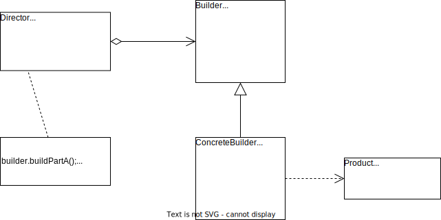

# 建造者模式

## 概述

**建造者模式**：将一个**复杂对象**的构建与它的表示分离，使得同样的构造过程可以创建不同的表示。

> **Builder Pattern**: Separate the construction of a complex object from its representation so that the same construction process can create different representation.

建造者模式是一种对象创建型模式，它将客户端与包含多个部件的复杂对象的创建过程分离，客户端无需知道复杂对象的内部与装配方式，只需要知道所需建造者的类型即可。**建造者模式关注如何一步一步地创建一个复杂对象**，不同的建造者定义了不同的创建过程。

## 结构与实现

### 结构

建造者模式的结构如下图所示。

建造者模式的 4 个角色：

1. **Builder（抽象建造者）**：为创建一个产品对象的各个部件指定抽象接口，在该接口中一般声明两类方法，一类方法是 buildPartX()，它们用于创建复杂对象的各个部件；另一类方法是 getResult()，它们用于返回复杂对象。（可以是抽象类或者接口）
2. **ConcreteBuilder（具体建造者）**：实现了 Builder 接口，实现了各个部件的具体构造和装配方法，定义并明确所创建的复杂对象，还可以提供一个方法返回创建好的复杂产品对象（该方法也可以由抽象建造者实现）。
3. **Product（产品）**：被构建的复杂对象，包含多个组成部分，具体建造者创建该产品的内部表示并定规它的装配过程。
4. **Director（指挥者）**：指挥者又称导演类，负责安排复杂对象的建造次序，指挥者与抽象建造者之间存在关联关系，可以在其 construct() 建造方法中调用建造者对象的部件构造和装配方法，完成复杂对象的建造。客户端一般只需要与指挥者进行交互。

### 实现

[抽象工厂模式实现示例](./examples/designpattern/builder)

## 指挥者类的深入讨论

几种 Director 大变化形式：

1. 省略 Director，将 Director 与 Builder 合并。这不会影响系统的灵活性和可扩展性，同时还简化了系统结构，但加重了建造者的职责。如果 construct() 方法较为复杂，还是建议单独封装在 Director 中，更符合单一职责原则。
2. 钩子方法的引入（具体内容去翻书吧）

## 优/缺点和适用环境

### 优点

1. 在建造者模式中，客户端不必知道产品内部组成的细节，将产品本身与产品的创建过程解耦，使得相同的创建过程可以创建不同的产品对象。
2. 每一个具体建造者都相对独立，而与其他的具体创建者无关，因此可以很方便地替换具体建造者或增加新的具体建造者，用户使用不同的具体建造者即可得到不同的产品对象。指挥者类针对抽象建造者编程，增加新的具体建造者无需修改原有类库的代码，扩展方便，符合开闭原则。
3. 可以更加精细地控制产品的创建过程。将复杂产品的创建过程分解在不同的方法中，使得创建过程更加清晰，也更方便使用程序来控制创建过程。

### 缺点

1. 建造者模式所创建的产品一般具有较多的共同点，其组成部分相似，如果产品之间的差异性很大，例如很多组成部分都不相同，不适合使用建造者模式，因此其使用范围受到一定的限制。
2. 如果产品的内部变化复杂，可能会导致需要定义很多具体建造者类来实现这种变化，导致系统变得很庞大，增加系统的理解难度和运行成本。

### 适用环境

1. **需要生成的产品对象有复杂的内部结构**，这些产品对象通常包含多个成员变量。
2. **需要生成的产品对象的属性相互依赖，需要指定其生成顺序。**
3. 对象的创建过程独立于创建该对象的类。在建造者模式中通过引入指挥者类将创建过程封装在指挥者类中，而不在建造者类和客户端代码中。
4. 隔离复杂对象的创建和使用，并使得**相同的创建过程可以创建不同的产品**。